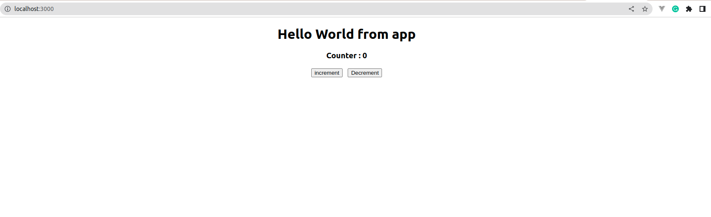

# Counter Application using React
Make counter application using react. Lets start without wasting time. Make a react Application, If you are not aware to make a react application than click on this link.

## Steps

1. Create React Application
2. Create a folder  ```component``` under ```src``` folder
3. Create a file ```counter.js``` under ```component``` folder which you made in step 2


Their are two ways to write code in component
1. JSX -> Html code we write in Javascript file
2. Scripting -> Javascript code for Bussniss logic


### Import react 

```
from React import 'react';
```

### Make a component

Important things
1. Always keep the first word capital on your component.
    1. Because react needs to get the difference between the html and react component.

Make an arrow function, It is also known as ananomous function
``` javascript
// Importing react
import React from 'react'

// Component
const Counter = () => {
    return  (
        <div>Hello World I am counter</div>
    )
};

// Exprting our component
export default Counter; 
```

## Import Component In app.js
Now You are done with making component lets import it in app.js
```javascript
import logo from './logo.svg';
import './App.css';
import React from 'react';
import Counter from './components/counter';

function App() {
  return (
    
    
    <div className="App">
      <h1>Hello World from app</h1>
      <Counter></Counter>
    </div>

    
  );
}

export default App;

```

## Start react application

Open your terminal
cd to the react directory
```
npm start
```

## Counter Logic
lets add our counter logic in our component

```javascript

import React, {useState} from 'react'

const Counter = () => {
    // Script part
    const [counter, setCounter] = useState(0) 
    // Increment setter
    const handleIncrement = () => {
        setCounter(counter+1)
    }
    // Decrement Setter
    const handleDecrement = () => {
        setCounter(counter-1)
    }
    // JSX part
    return  (
        <div>
        <h3>Counter : {counter} </h3>
        {/* writing incline css */}
        <button style={{marginRight:'12px'}} onClick={()=> handleIncrement()}>increment</button>
        <button onClick={()=> handleDecrement()}>Decrement</button>
        </div>
    )
};


export default Counter;
```


### Front-end View


